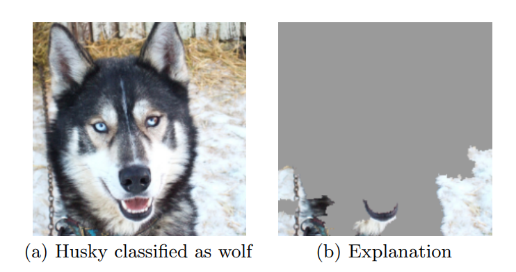
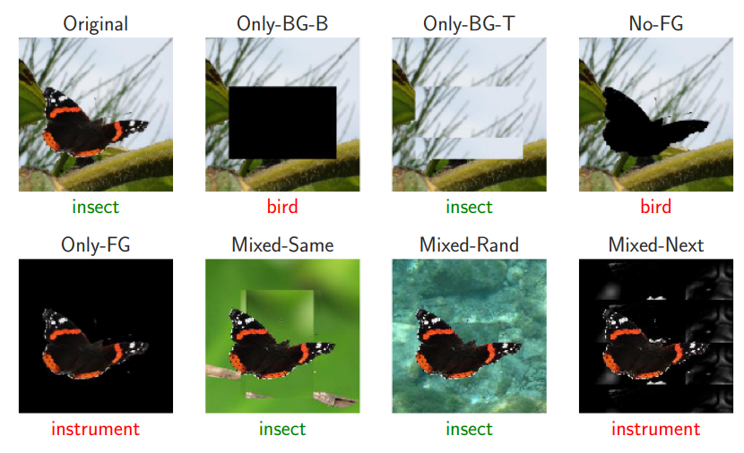
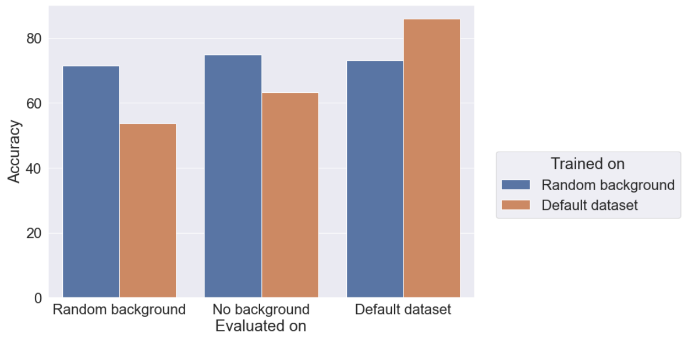
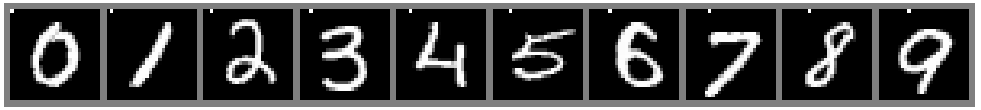
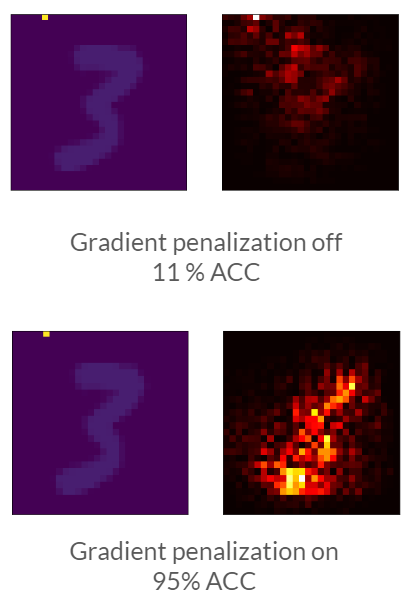
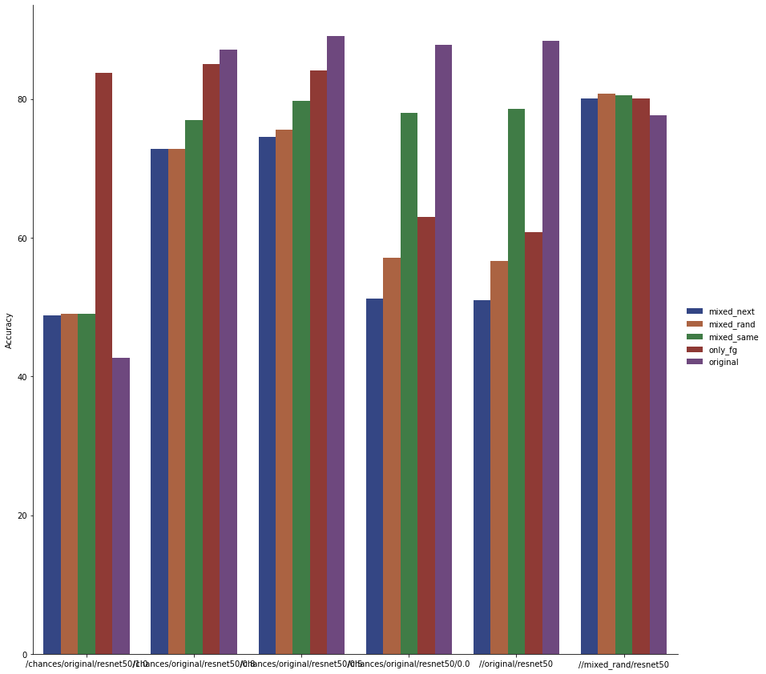
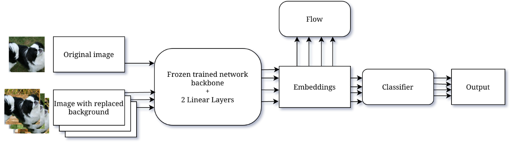
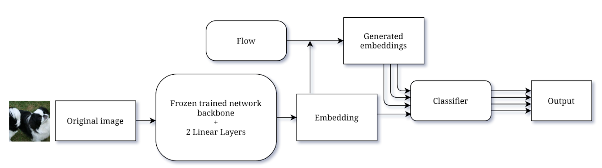
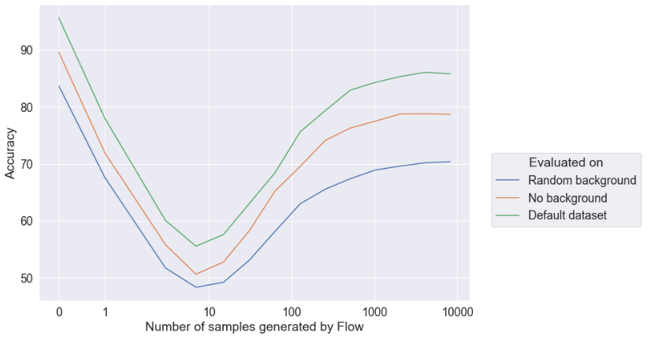

# Mitigating image background bias in DNN

The following repository contains source code for a research project undertaken at Wrocław University of Science and Technology as a part of 3-semester long research class. The project was a part of Artificial Intelligence Master's program at WUST co-financed by [AI-Tech](https://www.gov.pl/web/aitech)

Authors:

- Tomasz Grzegorzek (formulation of the problem, gradient penalization, dynamic background replacement)
- Maciej Ziółkowski (dynamic background replacement, Flow-based methods)

We thank our supervisor  dr hab. inż. Maciej Zięba for continuning support during this project.

# Introduction

For a long time, neural network have been known to fall into [shortcut learning](https://arxiv.org/pdf/2004.07780.pdf). One of the specific shortcut learning that may come into life is learning simple signals from backgrounds. As an example, we present a case from ["Why Should I Trust You?": Explaining the Predictions of Any Classifier](https://arxiv.org/pdf/1602.04938.pdf) below. 



Image was classified as wolf instead of husky because of easily learnable snow in the background. This is not a standalone case. The phenomenon was studied in depth by Aleksander Mądry et al in [Noise or Signal: The Role of Image Backgrounds in Object Recognition](https://arxiv.org/pdf/2006.09994.pdf) Authors of this paper checked how changing background, or removing it all together, changes prediction of the model. 




It turned out, that not only changing background gave different results but that some example actually need background to have a correct prediction. As a natural form of data augmentation, authors  suggested to randomly replace backround once before training. This gave promising results, especially on test sets where backgrunds were also changed or removed, but accuracy on original dataset was hurt. 



This might be due to lost correlation of object and background when randomization of background is performed

> **Project Goal:** Develop a method that will be as good as the model trained on random background w.r.t to images with random and removed background but keep the score on original images.

# Datasets
1. **One-pixel MNIST** Inspired by [Latent Adversarial Debiasing: Mitigating Collider Bias in Deep Neural Networks
](https://arxiv.org/pdf/2011.11486.pdf). We modified MNIST so that the class number of an example is embedded on first row of each image. 
2. **Background-coloured MNIST** inspired by the same paper above. Each class has encoded bias in encoded color. 
3. Image-Net-9 (IN-9). Subset of ImageNet containing only 9 class. Proposed by Mądry et al. Data consists examples without background which acts as a binary mask. We are able to replace backgrounds. 

During evaluation, bias is shifted. For one-pixel MNIST, we either remove bias encoding class or we shuflle encoding pixels. This  way an example where "7" appear might have pixel number 3 selected in the first row. Similarly for background-colored MNIST, zeros might have other backgrounds than red etc. For IN-9 we test sets  that have background from generated in a specific way. Please refer to original paper by Mądry et al.

# Developed Methods

## Gradient penalization w.r.t background

We have started our work by considering what does it mean, mathematically, that background gives an easy signal to be learned from. We turned to concept of norm of gradient of part of input w.r.t to prediction. This should be a measure of impact a specific part of image has on prediction. We decided to modify loss function by penalizing norm of gradient of background w.r.t 

Results were promising on synthethic datasets with clear bias. For example, on one-pixel MNIST we were able to almost completely remove dependency on background. Below we present silency maps for models with and without gradient penalization, as well as reported accuracy on test set with perturbed biased. In this example, we can see that encoding pixel points to class "5". Without penalization, prediction is made solely based on this single pixel which results in random prediction in general. Turning on penalization allow to escape simple signal.



For background-coloured MNIST we had some success, namely, we were able to obtain  around 45% accuracy. We further investigated this matter and found that background is such a strong signal that it  seems to be impossible to surpress its impact. We also notices that since background in this case is heavily intertwined on border of images, it might be the case that learned convolutional kernels are dependent on value of background. We tested this hypothesis  by dilating background around the number leaving the rest of background untouched as below. 


With more space around the number, we were able to increase accuracy to even 85 percent. However, because of this limitation, we decided to test other methods.

## Dynamic background replacement

Mądry proposed static background replacement done once before training. Instead, we propose to change backgrounds on-the-fly during training as a form of data augmentation. Each example has a chance to have random background assigned with some probability *p*, which is a hyperparameter. Results, differentiating between value of p is presented below. 




We discovered, that our method is able to keep score on original test data high while still improving on images with replaced or removed backgrounds. Best results were observed for *p=0.2*

## Flow-based Background Embedding Manipulation

While dynamic background replacement was succesful, we started pondering that we are limited by number of available backgrounds. In a perfect situation, we would be able to generate backgrounds on demand. There are generative models like GAN that are designed for this purpose but adding GAN, which is usually a fairly large model, seems like an overkill. Moreover, it's extremely difficult to generate desired images without any artefacts. Instead we could manipulate image embeddings. The idea of training is like this:

1. Get a pre-trained backbone like ResNet and freeze its layers. 
2. For each example, with all its variants of background, get its embedding, that is, output of a layer that proceeds classification layer.
3. Train Normalizing Flow to map from embedding space to simple distribution (and vice versa) conditionally on image background class and classifier to differentiate between classes, all end-to end.



During evaluation :

1. We use trained Normalizing Flow  to generate as many embeddings as desired in number equally distributed per class. 
2. We classify all embeddings.
3. We use majority voting to decide on final prediction.




Results are dependent on number of sampled embedding from the Normalizing Flow and are presented below:



Although methodology seems correct, we were not able to obtain satisfactory result. Discussion on this is continued in [Further work](#further-work)

# Results

For now, our best method is a dynamic background replacement. We already presented results on specific subsets of IN-9. Below we also present results on [Background Challenge](https://github.com/MadryLab/backgrounds_challenge). The goal of Background Challenge is to see how many examples will not be susceptible on background manipulation. If we take an example, then there should be no background in test set that makes prediction wrong. 

| Method                                            | Accuracy  |
|---------------------------------------------------|-----------|
| ResNet-50 (Trained on IN-9)                       | 12.0%     |
| ResNet-50 (Trained on whole ImageNet)             | 22.3%     |
| ResNet-50 with Static Background Replacement      | 33.7%     |
| **ResNet-50 with Dynamic Background Replacement** | **34.8%** |

# Further work

For methods modifying loss function, we believe it would be worth exploring the concept of aggregated gradient, where aggregation would be done over smoothed background. Furthermore, we would like to incorporate penalizing network for specifically classifying image to class that belng to replaced background. 

We would like to extend dynamic background replacement by introducing self-learnable per-class *p* parameter. We recognise each class might have different bias ratio that should be taken into account during training. This idea could be extended even further with dependency matrix between classes. 

Normalizing Flows require more attention with the quality of the mapping. We need to develop tools that will show us how well distributions are estimated. 

# Running experiments

We provide all datasets via DVC.

To run basic training (all data should be DVC-synced, mind the paths): 

```bash
python3 ./train/scripts/in9l_network.py -n resnet50 -d "RobOptWUST/data/mixed_rand" -e 200
 ```
To run dynamic background replacement  (all data should be DVC-synced, mind the paths): 
```
python3 ./train/scripts/in9l_network.py -n resnet50 -d data/original" --backgrounds-path "data/only_bg_t/" --foregrounds-path "data/only_fg/" -t --background-transform-chance 0.8 -e 200
```

To run Normalizing Flows:

```
python3 ./train/scripts/in9l_network.py -n resnet50 -d "data/original" --base-model-path "path/to/pytorch/pickled/model" --use-swap-background-minibatch-loader --backgrounds-path "data/only_bg_t/train" --foregrounds-path "data/only_fg/train" --use-flow-model --use-loaded-model
```